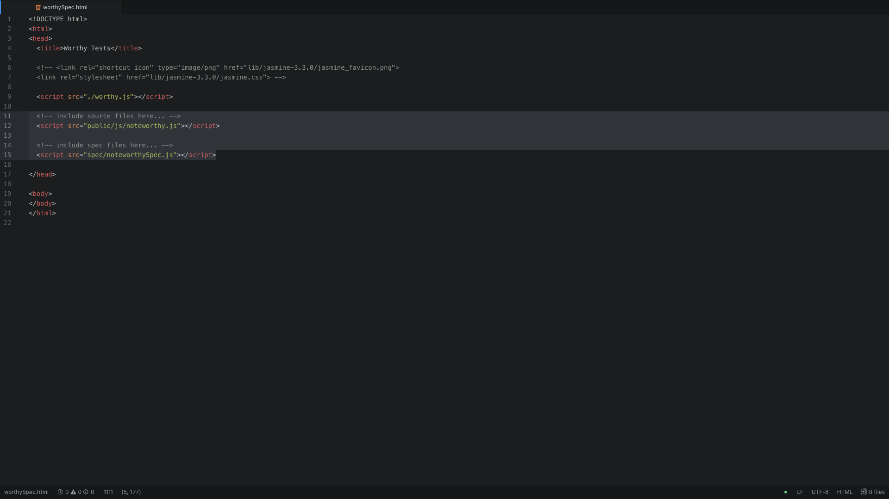

# NoteWorthy #

## Worthy ##
Worthy is a testing framework built for the NoteWorthy app using JavaScript. We wrote example tests (below) based on Jasmine in order to determine which testing functions we would need. At present there is only a need for an equivalent to Jasmine's .toEqual function so we decided to create a testing framework that would only check that two things are equal to each other.

```
************** Add Method ****************
note.add('dsfsdfdsf')
expect(note.list.length).toqual(1)
expect(note.list[0]).toequal('dsfsdfdsf')

************ Abbreviated List Method *****************
it('returns an abbreviated list of notes', function{
  note.add('dsfsdfdsfdudhsadjkashdksajdhjashdkjashdkasjdhaksjhdkajsdhkjashdkjashdkj')
  expect(note.abbrev_list()[0]).toequal('abc... x20')
  expect(note.abbrev_list()[0].length).toequal(20)
});

************** Multiple Abbreviated notes *******************
note.add('notes 1 - asdasdas')
note.add('notes 2 asdasadasdas')
expect(note.abbrev_list()).toequal([a, b])

***************** view individual note *****************
exampleNote = 'dsfsdfdsfdudhsadjkashdksajdhjashdkjashdkasjdhaksjhdkajsdhkjashdkjashdkj'
note.add(exampleNote)
expect(note.viewIndividualNote(0)).toEqual(exampleNote)
```

### How to Use ###
1. Copy the files `worthy.js` and `worthySpec.html` into the project folder.

2. Edit the `worthySpec.html` file to include your code and test files:


3. Write your tests in your spec file (`spec/noteworthySpec.js` in this instance) following the guide below.

#### How to Write a Test ####
In spec/noteworthySpec.js:

```JavaScript
it(description).expect(testingFunction).toEqual(expectedValue)
```

* 'description' - a string describing the test.
* 'testingFunction' - the function you are testing (e.g. calculator.add(1,3) ).
* 'expectedValue' - the result your are expecting.

_Example_
```JavaScript
it('calculator adds two numbers together').expect(calculator.add(1,3)).toEqual(4)
```

##### How to Create a Double #####
```JavaScript
var mock = new DoubleObj('mockMethod', returnValue)
```

* 'mockMethod' - the name of the function to be mocked.
* 'returnValue' - what to return when calling the method.

**Note:** _Additional methods currently have to be created in a new DoubleObj._

_Example_
```JavaScript
var mock = new DoubleObj('mockMethod', 4)
it('returns a mocked method').expect(mock.mockMethod()).toEqual(4)
```

#### How to Write a Test (Old Framework) ####
In spec/noteworthySpec.js:

```JavaScript
new Test(description, testingFunction, testType, equalTo)
```

* 'description' - a string describing the test.
* 'testingFunction' - the function you are testing (e.g. calculator.add(1,3) ).
* 'testType' - the matcher you want to use (i.e. 'equalTo' or 'notEqualTo')
* 'equalTo' - the result your are expecting.

_Example_
```JavaScript
new Test('calculator adds two numbers together', calculator.add(1,3), 'equalTo', 4)
```
